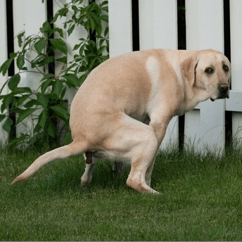
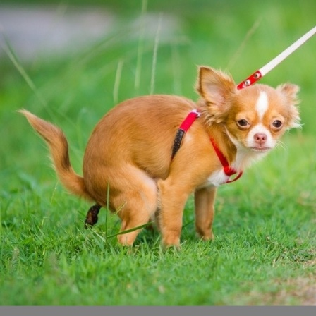
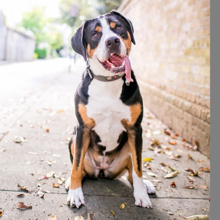
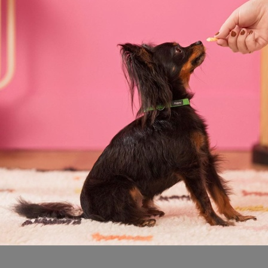

# Dog Poop Dataset

## Description
The Dog Pooping Dataset (DPD) is a curated collection of images designed to train and evaluate image classification models, such as MobileNet V2, for identifying whether a dog is pooping or not. The dataset is specifically tailored for binary classification tasks, with images categorized into two classes: "Poop" and "Not Poop."

Images in this dataset are sourced from a combination of publicly available videos and original recordings, featuring a variety of dog breeds, environments, and postures to ensure diversity and robustness. Each image has been manually labeled, cropped, and processed to focus on the relevant activity while maintaining quality and consistency.

This dataset aims to support machine learning research in pet activity monitoring, behavior analysis, and related fields, providing a valuable resource for researchers and developers working on innovative solutions in animal care and AI-powered pet monitoring systems.

---

## Dataset Structure
The dataset is organized into three main folders: `train`, `val`, and `test`. Each of these folders contains two sub-folders, one for each class: `poop` and `notpoop`. The folder structure is as follows:

```
dpd2024/
  ├── train/
  │   ├── poop/
  │   └── notpoop/
  ├── val/
  │   ├── poop/
  │   └── notpoop/
  └── test/
      ├── poop/
      └── notpoop/
```
- **train/**: Contains images for training the model.
- **val/**: Contains images for validating the model during training.
- **test/**: Contains images for evaluating the model's performance after training.

The folder names (`poop` and `notpoop`) act as the labels for the images.

---

### File Format
- Images are in `.jpg` format.
- Resolutions vary. The maximum size of image is 448x448 pixels.

---

## Dataset Size
- **Total images**: 4,869
  - **Train**: 3,405 images
  - **Validation**: 734 images
  - **Test**: 733 images
- **Class distribution**:
  - Poop: 2,292 images
  - Notpoop: 2,577 images

---

## File Formats
- All images are in `.jpg` format.
- Image resolutions vary but maximum size is 488x488 pixels.

---

## Sample Images

Here are a few sample images from the dataset:

### Poop Class



### Not Poop Class



## Usage
This dataset is suitable for binary classification tasks. 
**Example Notebook**:
Notebook [dogpoop_mobilenetv2](https://www.kaggle.com/code/wengjiyao/dogpoop-mobilenetv2)
Python application [Dog_Poop_Tracker](https://github.com/wengjiyao/Dog-Poop-Tracker)
---

## Licensing

This dataset is provided under the [World Bank Dataset Terms of Use](https://datacatalog.worldbank.org/public-licenses#data). Users must comply with these terms when using the dataset.

---
